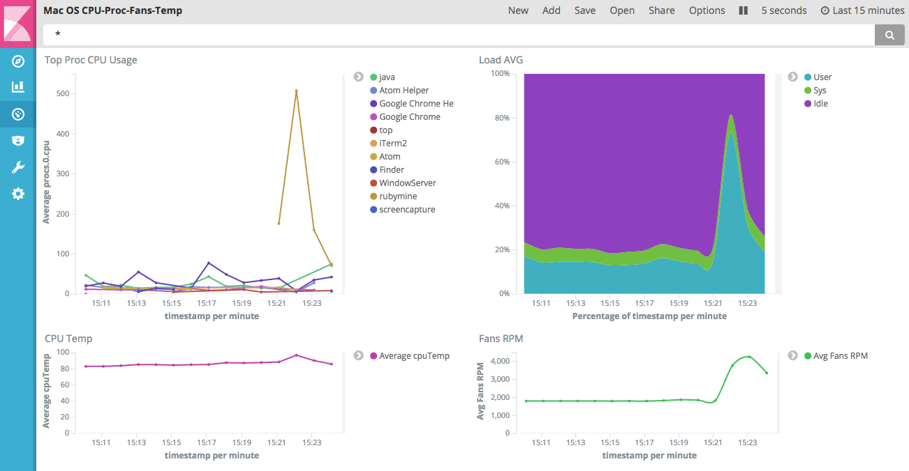

# Monitoring Mac OS X top procs, Load, CPU Temp and Fans RPMs using Elasticsearch and Kibana

## Installing Elasticsearch and Kibana

```sh
brew install elasticsearch
brew services start elasticsearch
brew install kibana
brew services start kibana
```

## Starting CPU Tracker

```sh
yarn install
yarn start
```

## Starting and configuring Kibana

* Open [Kibana](http://localhost:5601)
* Add "load" index name
* Open [Management / Saved Objects](http://localhost:5601/app/kibana#/management/kibana/objects) and Import `kibana/config.json`
* Open [Dashboard](http://localhost:5601/app/kibana#/dashboard/Mac-OS-CPU-Proc-Fans-Temp) and set Auto-Refresh to 5 seconds and Time Range to Last 15 minutes 


